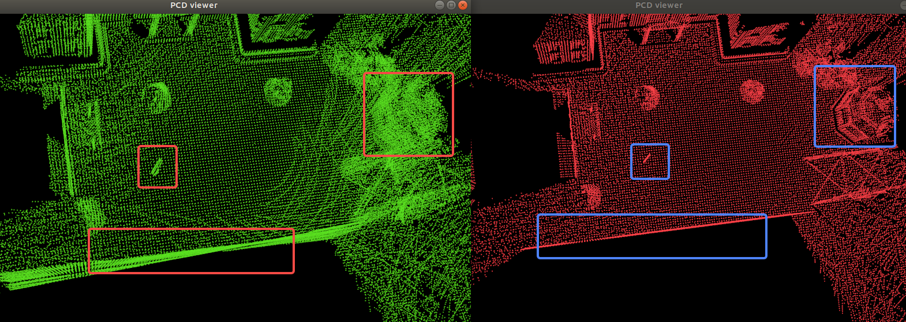
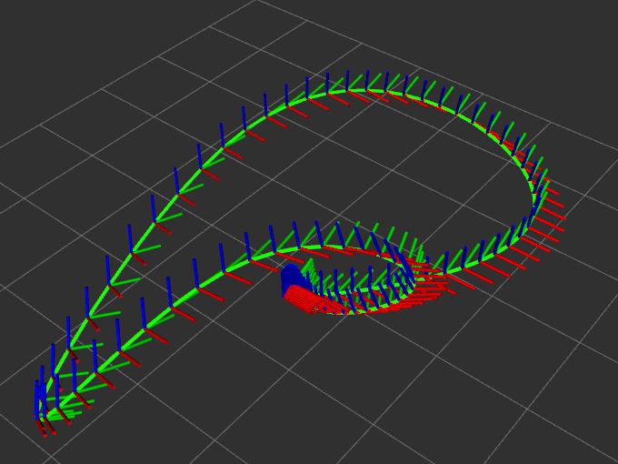
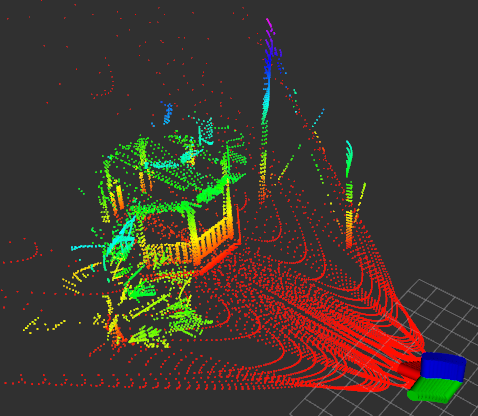
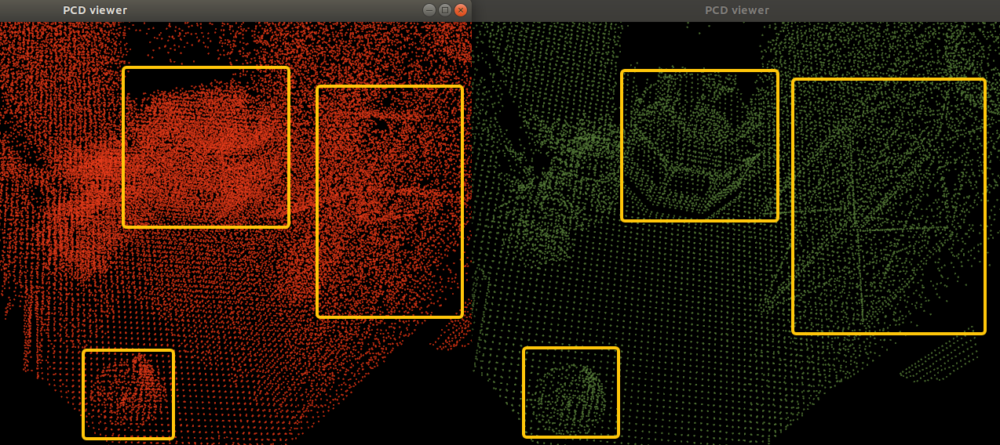

# SDPC: Simulator for distorted pointcloud

## Intro.

Usually, LiDAR plugins based on Gazebo adopt the method of collecting one frame of  point clouds at the same timestamp. While such method is fast, it has many drawbacks:

* not adhere to the working principles of LiDAR
* each point cloud does not come with a timestamp
* unable to simulate real motion distortions



This repository implements a point cloud acquisition tool that faithfully follows the actual operation of a LiDAR. It involves two steps: 

1. Customizing spline motion trajectories, which allows customization of spline trajectories for arbitrary rapid movements. 

2. Ray casting and point cloud acquisition, writing into rosbag.

## Dep.

- [x] Ubuntu18.04 is tested
- [x] ROS melodic is tested 
- [x] Gazebo9 is tested
- [x] PCL Library


## Usage

### Customizing Spline

`path_dir` is where you save traj file, format is same as [3].
```txt
# time, x(m), y(m), z(m), roll(deg), pitch(deg), yaw(deg)
0,   0,   0,    1,    0, 0,  0
1,   0.1, 0.03, 1.2,  10, 8, 10
2,   0.4, 0.2,  0.9,  2, -9, 30
3,   1.0, 0.5,  1.5,  15, -17, 17
4,   -0.4, -0.3, 1.3, -5, -5, 5
5,   -1.0, -2.0, 0.6, -20, -25, -20
6,   -2.0, 1.3, 0.9, -3, -3, -5
8,   1.3,  2.0, 1.4, 13, 10, 10
10,  0, 0, 1, 0, 0, 0
```
First column is time scale factor, not the real time.

Then you can visual your traj by `show_path.launch`.
```xml
<node name="show_path" pkg="sdpc" type="show_path" output="screen">
    <param name="total_time" value="10" />  // total sim time
    <param name="dt" value="0.1" />         // time step for frame to draw
    <param name="path_fn" value="$(find sdpc)/path_dir/path_test.txt" />    // spline knots file
</node>
```

```bash
roslaunch sdpc show_path.launch
```

You will see:




### Run and save bag

Config file `run.launch` and `lidar.xacro`.
```xml
    <arg name="world_name" value="trees" />
    <param name="total_time" type="double" value="10.0" />
    <param name="path_fn" type="string" value="$(find sdpc)/path_dir/path_test.txt" />
    <param name="save_bag" type="string" value="$(find sdpc)/bag/dist.bag" />    
    <param name="lidar_topic" type="string" value="lidar_points" />
    <param name="lidar_type" type="string" value="velodyne" />
    <param name="save_pcd" type="bool" value="true"/>
    <param name="pcd_dir" type="string" value="$(find sdpc)/pcd/"/>
```

For now only support velodyne
```xml
    <plugin name="dpc_lidar" filename="libsdpc.so">
        <ray>
            <scan>
                <horizontal>
                    <!-- when use velodyne -->
                    <samples>1800</samples>
                    <!-- when use avia -->
                    <!-- <samples>24000</samples> -->
                    <resolution>1</resolution>
                    <min_angle>0</min_angle>
                    <max_angle>360</max_angle>
                </horizontal>
                <vertical>
                    <samples>16</samples>
                    <resolution>1</resolution>
                    <min_angle>-15</min_angle>
                    <max_angle>15</max_angle>
                </vertical>
            </scan>
            <range>
                <min>0.2</min>
                <max>100</max>
                <resolution>1</resolution>
            </range>
            <noise>
                <type>gaussian</type>
                <mean>0</mean>
                <stddev>1e-6</stddev>
            </noise>
        </ray>
        <visualize>false</visualize>
        <hz>10</hz>
        <downsample>1</downsample>
    </plugin>

```

Then you can run:
```
roslaunch sdpc run.launch
```

### Display your bag

see `launch/vis_bag.launch`:
```xml
<node name="vis_bag" pkg="sdpc" type="vis_bag" output="screen" >
    <param name="N_SCANS" value="6" />
    <!-- specify your bag generated by the program -->
    <param name="bag_fn" value="$(find sdpc)/bag/avia.bag" />
</node>
```

```bash
roslaunch sdpc vis_bag.launch
```

<center class="half">
    
    
</center>


## Perf.

Compared to Lips[3], as far as i know has same function as SDPC, it acquires one frame
velodye 16*1800 pointclouds cost 12s with 10 planes. But SDPC does not limit to plane
scenarios, and 10x times faster!!

## Ack.

Code references to [1-5] and adapts from [2-3]. Thanks to the open source.


## TODO

- [x] Livox support

Avia mapping:




- [x] IMU support
- [ ] FastLIO/PointLIO demo
- [ ] GPU support, long way to go!


## Ref

[1] https://github.com/lmark1/velodyne_simulator

[2] https://github.com/lvfengchi/livox_laser_simulation

[3] https://github.com/rpng/lips

[4] https://github.com/gazebosim/gazebo-classic

[5] https://github.com/ttk592/spline